## Interactive slides available here

::: {.r-fit-text .centered}



or

<https://florian-wagner.github.io/permacost-ert-pygimli>
:::

## Geophysical monitoring of subsurface processes
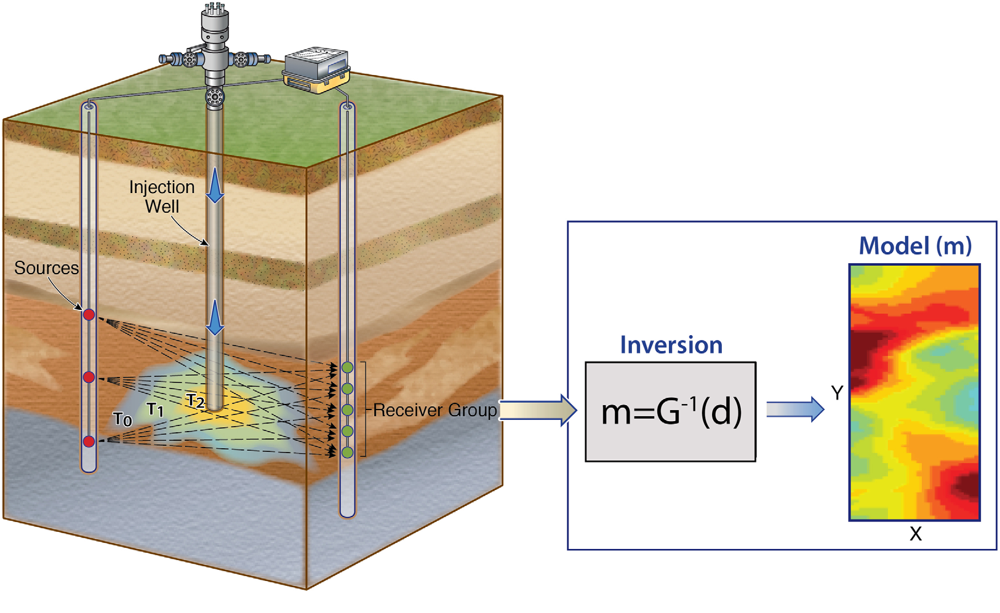

## Quantitative imaging and monitoring is challenging
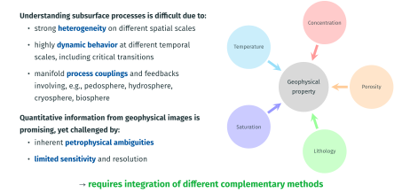

## The evolution of geophysical imaging for subsurface characterization

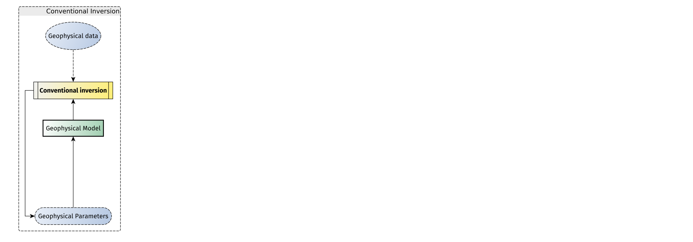{.absolute top=100}
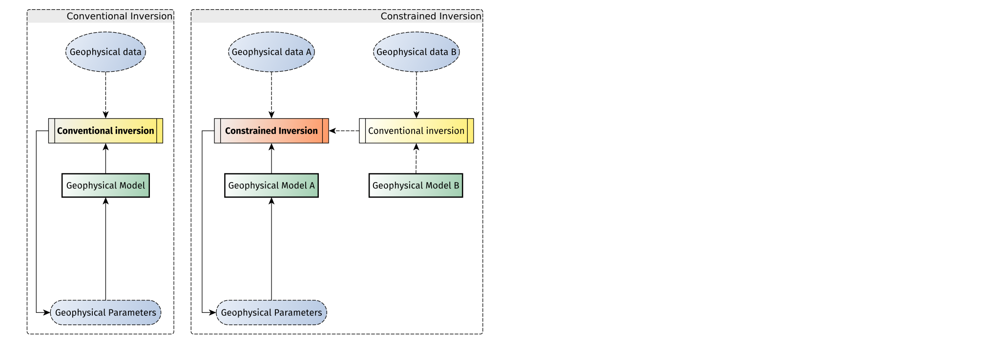{.fragment .fade-in-then-out .absolute top=100}
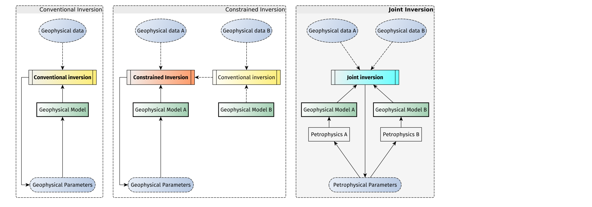{.fragment .fade-in-then-out .absolute top=100}
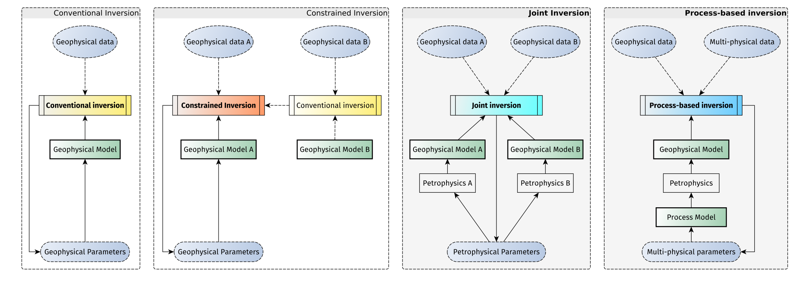{.fragment .fade-in .absolute top=100}

[[@Wagner2021]]{.small .absolute bottom=100 right=100}

[--> model coupling is challenging and requires versatile open-source software]{.fragment .absolute bottom=100}

# Introduction to py**GIMLi**

##  py**GIMLi** is a versatile open-source toolbox with:
::: {.columns}
::: {.column width="65%" .incremental}
- management tools for **structured and unstructured meshes** in 2D & 3D
- computationally efficient **finite-element and finite-volume solvers**
- **various geophysical forward operators**: ERT/IP, Seismics/GPR traveltime, Gravity, Magnetics, SP, EM
- frameworks for **constrained, joint and
process-based inversions** with **region-specific regularization**
- **open-source, platform compatible**, documented & tested code
- suitability for **teaching & reproducible research**
- v1.0 published in *Computers and Geosciences* [@Ruecker2017] [(among *5 Most Downloaded* papers and 480 citations)]{style="color:gray;"} and broadly used since
:::


::: {.column width="35%"}
::: {.r-stack}
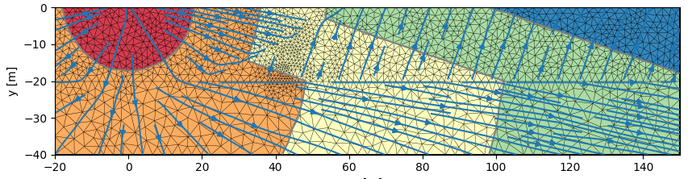{height=120}
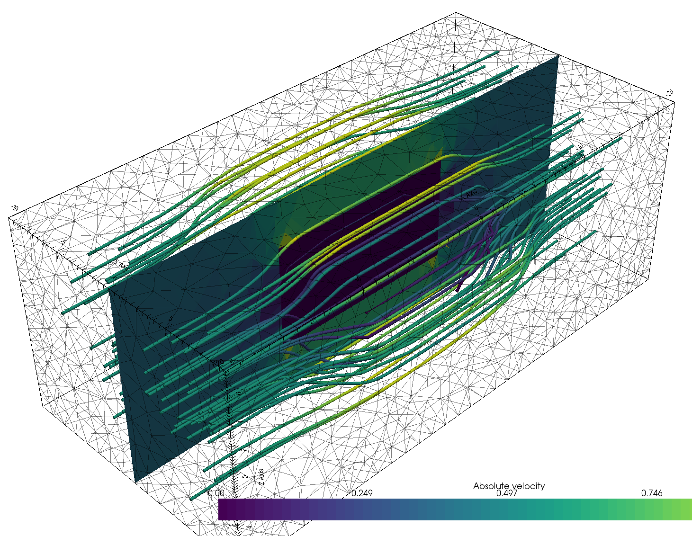{height=200}
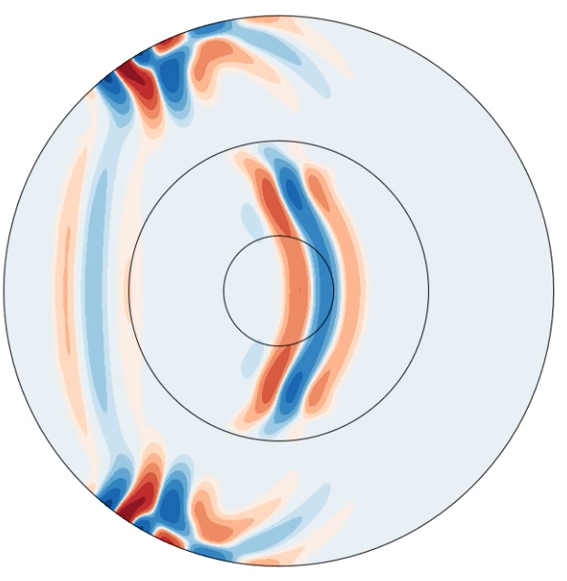{height=180}
:::
:::
:::

## Basic inversion framework
:::: {.columns}
::: {.column}

The default inversion framework is based on the generalized Gauss-Newton method and is compatible with any given forward operator and thus applicable to various physical problems.

$$ \mathbf{W}_\text{d} (\mathbf{F}(\mathbf{m})-\mathbf{d}) \|^2_2 + \lambda \| \mathbf{W}_\text{m} (\mathbf{m}-\mathbf{m_0}) \|^2_2 \rightarrow\min $$

::: {.callout-note}
The inversion is physics-independent and very flexible in terms of adding prior information, regularization and integrating different geophysical methods.
:::

Website and documentation: <https://pygimli.org>

Rücker, C., Günther, T., Wagner, F.M., 2017. pyGIMLi: An open-source library for modelling
and inversion in geophysics, Computers and Geosciences, 109, 106-123.
:::

::: {.column}
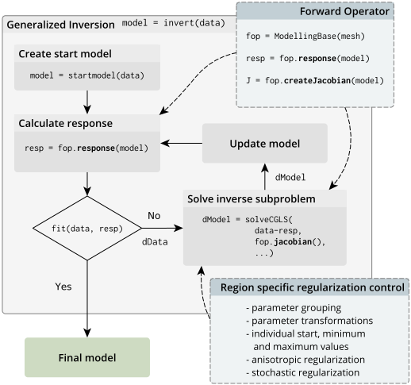
:::

::::


## Software design
:::: {.columns}
::: {.column width="60%"}

pyGIMLi is organized in three different abstraction levels:


::: {.panel-tabset}
## Application level

In the application level, ready-to-use method managers and frameworks are provided. Method managers (`pygimli.manager`) hold all relevant functionality related to a geophysical method. A method manager can be initialized with a data set and used to analyze and visualize this data set, create a corresponding mesh, and carry out an inversion. Various method managers are available in `pygimli.physics`. Frameworks (`pygimli.frameworks`) are generalized abstractions of standard and advanced inversions tasks such as time-lapse or joint inversion for example. Since frameworks communicate through a unified interface, they are method independent.

## Modelling level

In the modelling level, users can set up customized forward operators that map discretized parameter distributions to a data vector. Once defined, it is straightforward to set up a corresponding inversion workflow or combine the forward operator with existing ones.


## Equation level

The underlying equation level allows to directly access the finite element (`pygimli.solver.solveFiniteElements()`) and finite volume (`pygimli.solver.solveFiniteVolume()`) solvers to solve various partial differential equations on unstructured meshes, i.e. to approach various physical problems with possibly complex 2D and 3D geometries.

:::

:::

::: {.column width="40%"}
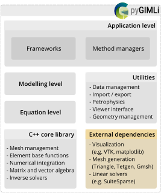
:::

::::

##  Existing tutorials

::: {.columns}
::: {.column .incremental width="65%"}
- [Transform 2021](http://transform21.pygimli.org): creating **geometries & meshes**, **modeling** PDEs, **synthetic data**, **inversion** (also with **external forward operator**).
- [Transform 2022](http://transform22.pygimli.org):  fundamental `pyGIMLi` objects (`Mesh`, `DataContainer`, matrix types, etc.), **geostatistical** vs. smoothness regularization, treatment of subsurface **regions**, adding **prior data**.
- [SEG webinar 2024](http://seg24.pygimli.org): invert **real-life 3D data** [@Huebner2017] to tweak your **inversion beyond the standard** practice. 
- [GELMON 2025](http://gelmon25.pygimli.org): ERT time-lapse data processing and inversion + image appraisal
:::
::: {.column width="35%"}
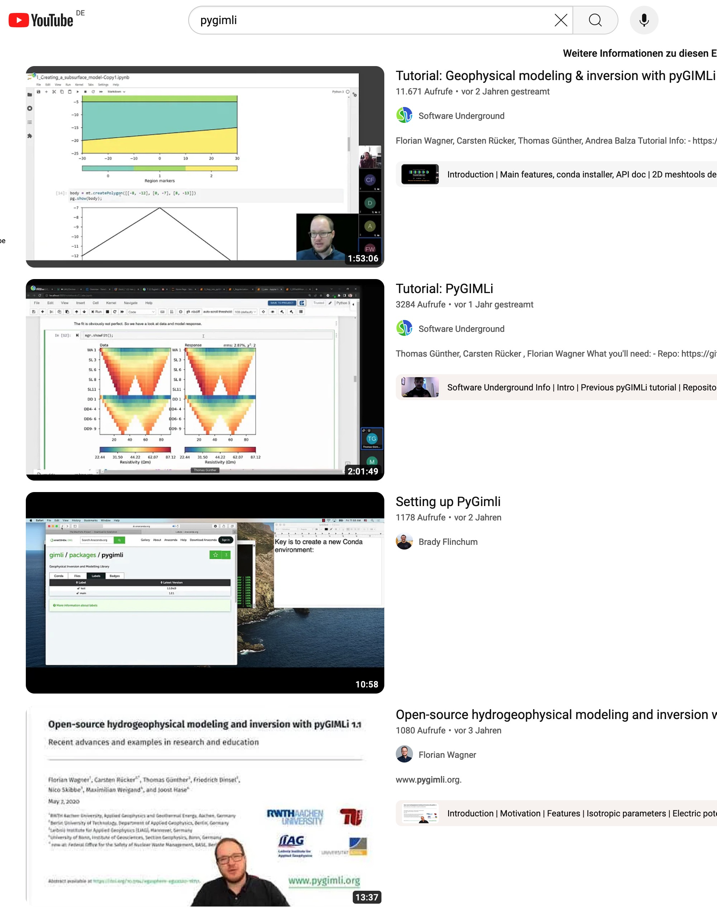{width=90%}
:::
:::


##  Recent developments in py**GIMLi**

::: {.incremental}
- **Improved 3D visualization** powered by [pyvista](https://pyvista.org) (including filters, slices and interactive notebook compatibility)
- **3D gravity and (full-tensor) magnetics** operators and managers
- **New matrices and matrix generators**
- `LSQRinversion` framework enabling additional parameter relations [from @Wagner2019]
- `MultiFrameModelling` framework for temporally/spectrally/spatially constrained inversion
- `TimelapseERT` class with different strategies, e.g. **4D inversion**
- **New examples** on ERT (2D/3D crosshole, 3D surface, timelapse), IP, 3D magnetics
- **Improved website** and new user-guide coming soon 
- enabled `pip install pygimli` for easier installation (e.g. on Google Colab)
- fully **complex-valued** (FD) ERT-IP inversion (also for TD)
:::


##  Join the pyGIMLi user community!

::: {.columns}
::: {.column width="50%"}
{width=80%}

> "In open source, we feel strongly that to really **do something well**, you have to get a lot of people involved."
>
> *– Linus Torvalds*
:::

::: {.column width="50%" .noincremental}
1. **Join the `#pyGIMLi` chat** on [Mattermost](https://softwareunderground.org/mattermost)!
2. **Open a discussion** or **raise an issue** [on  GitHub](https://github.com/gimli-org/gimli).
3. **Contribute to the website** via the "Improve this page" button in the right sidebar.
4. **Add your** pyGIMLi-powered **publication** to [this database](https://github.com/gimli-org/gimli/blob/dev/doc/gimliuses.bib).
5. **Send your example** to [mail@pygimli.org](mailto:mail@pygimli.org).
6. **Contribute to the code** as described in [our contribution guidelines.](https://pygimli.org/contrib.html)
:::
:::

# Modeling demonstration


## Creating a simple subsurface model {auto-animate=true}

```{python}
import pygimli as pg
import pygimli.meshtools as mt

# Create a simple 3 layer model
world = mt.createWorld(start=[-20, 0], end=[20, -16], layers=[-2, -8],
                       worldMarker=False)

pg.show(world, markers=True)
```

## Creating a simple subsurface model {auto-animate=true}

```{python}
import pygimli as pg
import pygimli.meshtools as mt

# Create a simple 3 layer model
world = mt.createWorld(start=[-20, 0], end=[20, -16], layers=[-2, -8],
                       worldMarker=False)

# Create a heterogeneous block
block = mt.createRectangle(start=[-6, -3.5], end=[6, -6.0],
                           marker=4,  boundaryMarker=10, area=0.1)

# Merge geometrical entities
geom = world + block

pg.show(geom, markers=True)
```

## Meshing the geometry
```{python}
mesh = mt.createMesh(geom, quality=33, area=0.2, smooth=[1, 10])
pg.show(mesh)
```

## Solving a PDE on the mesh

$$c \frac{\partial u}{\partial t} = \nabla\cdot(a \nabla u) + b u + f(\mathbf{r},t)~~|~~\Omega_{\text{Mesh}}$$

```{python}
T = pg.solver.solveFiniteElements(mesh,
                                  a={1: 1.0, 2: 2.0, 3: 3.0, 4:0.1},
                                  bc={'Dirichlet': {8: 1.0, 4: 0.0}},
                                  verbose=True)
ax, _ = pg.show(mesh, data=T, label='Temperature $T$',
                cMap="hot_r", nCols=8, contourLines=False)

pg.show(geom, ax=ax, fillRegion=False)
```


## References

::: {#refs}
:::
